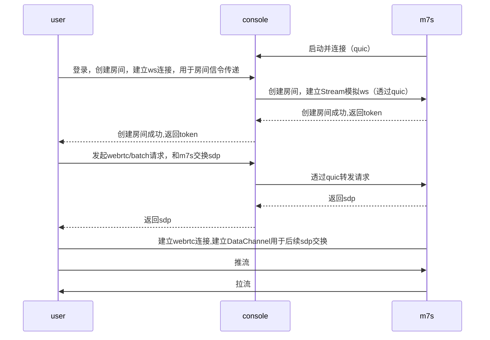

# 房间示例基本原理

房间的功能由m7s实例提供，房间内的音视频流也是通过m7s实例进行转发，并非通过console转发。
console只是起到UI界面的作用。

## 时序图

```mermaid

sequenceDiagram

participant user
participant console
participant m7s
m7s->>console: 启动并连接（quic）
user ->> console: 登录，创建房间，建立ws连接，用于房间信令传递
console->>m7s: 创建房间，建立Stream模拟ws（透过quic）
m7s -->> console: 创建房间成功,返回token
console -->> user: 创建房间成功,返回token
user ->> console: 发起webrtc/batch请求，和m7s交换sdp
console ->> m7s: 透过quic转发请求
m7s -->> console: 返回sdp
console -->> user: 返回sdp
user -> m7s: 建立webrtc连接,建立DataChannel用于后续sdp交换
user ->> m7s: 推流
m7s ->> user: 拉流
```
